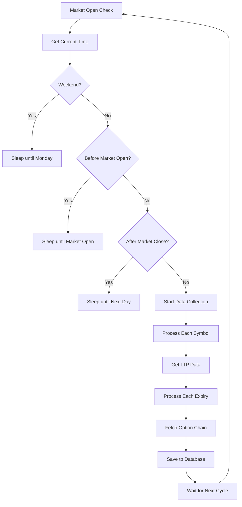
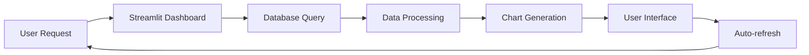

# Option Chain Dashboard - Complete Project Report & Deployment Guide

## 📋 Table of Contents
1. [Project Overview](#project-overview)
2. [System Architecture](#system-architecture)
3. [File Structure & Purpose](#file-structure--purpose)
4. [Data Flow & Logic](#data-flow--logic)
5. [Database Schema](#database-schema)
6. [Configuration & Environment](#configuration--environment)
7. [Deployment Guide](#deployment-guide)
8. [Usage Instructions](#usage-instructions)
9. [Troubleshooting](#troubleshooting)
10. [Technical Specifications](#technical-specifications)

---

## 🎯 Project Overview

The **Option Chain Dashboard** is a comprehensive real-time data collection and visualization system for Indian stock market options. It consists of two main components:

1. **Data Collection Server** (`main.py`) - Continuously fetches option chain data from Dhan Trading API
2. **Streamlit Dashboard** (`dashboard.py`) - Real-time visualization and analysis interface

### Key Features
- **Real-time Data Collection**: Automated collection of option chain data every minute during market hours
- **Multi-Symbol Support**: NIFTY, BANKNIFTY, SENSEX, RELIANCE, KOTAKBANK, INFY
- **Advanced Analytics**: Put-Call Ratio, Implied Volatility, Greeks analysis
- **Interactive Visualizations**: Stacked bar charts, heatmaps, time-series analysis
- **Database Storage**: PostgreSQL with organized schema structure
- **Auto-refresh Dashboard**: Real-time updates every 60 seconds

---

## 🏗️ System Architecture

```
┌─────────────────┐    ┌─────────────────┐    ┌─────────────────┐
│   Dhan Trading  │    │   Data Server   │    ┌   PostgreSQL    │
│      API        │───▶│    (main.py)    │───▶│   Database      │
└─────────────────┘    └─────────────────┘    └─────────────────┘
                                │                       ▲
                                ▼                       │
                       ┌─────────────────┐              │
                       │  Streamlit      │──────────────┘
                       │  Dashboard      │
                       │ (dashboard.py)  │
                       └─────────────────┘
```

### Architecture Components:
1. **API Layer**: Dhan Trading API for market data
2. **Data Processing Layer**: Python scripts for data collection and processing
3. **Storage Layer**: PostgreSQL database with organized schemas
4. **Presentation Layer**: Streamlit web application with **real-time database interaction**

---

## 🔄 Real-Time Dashboard & PostgreSQL Interaction

### **Live Database Connectivity**
The Streamlit dashboard maintains **continuous real-time interaction** with PostgreSQL:

#### **Dynamic Data Queries**
```python
# Real-time data fetching from PostgreSQL
def get_data_by_timeframe(symbol, expiry_filter, selected_date, timeframe_minutes):
    """Fetch data from PostgreSQL based on user selections"""
    query = f"""
    SELECT * FROM option_chain_{symbol.lower()}.{table_name}
    WHERE DATE(fetch_time) = '{selected_date}'
    AND fetch_time >= NOW() - INTERVAL '{timeframe_minutes} minutes'
    ORDER BY fetch_time DESC
    """
    return pd.read_sql(query, engine)
```

#### **Interactive Database Operations**
- **Real-time filtering**: Users can filter by symbol, date, expiry, timeframe
- **Dynamic queries**: SQL queries generated based on user selections
- **Live data updates**: Auto-refresh every 60 seconds with fresh database data
- **Persistent state**: User selections remembered across sessions

#### **Real-Time Chart Generation**
```python
# Charts are generated from live PostgreSQL data
def create_oi_chart(df):
    """Create OI comparison chart from database data"""
    latest_data = df.groupby('Strike Price').last().reset_index()
    # Chart generation from real-time database data
```

### **Dashboard Database Features**

#### **1. Live Data Tables**
- **Real-time data display**: Tables show current database records
- **Dynamic filtering**: Filter by any column in real-time
- **Sorting capabilities**: Sort by any field with live database queries
- **Pagination**: Handle large datasets efficiently

#### **2. Interactive Analytics**
- **Put-Call Ratio**: Calculated from live database OI data
- **Implied Volatility Analysis**: Real-time IV calculations
- **Greeks Analysis**: Live Greeks data from database
- **Volume Analysis**: Real-time volume patterns

#### **3. Advanced Pivot Tables**
- **Strike vs. Time Analysis**: Dynamic pivot table generation
- **Time-based aggregation**: Real-time data aggregation by time intervals
- **Metric selection**: Choose any metric for analysis
- **Chart variations**: Multiple visualization options

#### **4. Real-Time Monitoring**
```python
# Dashboard continuously monitors database
def get_dashboard_stats():
    """Get real-time statistics from database"""
    stats = {}
    for symbol in ['nifty', 'banknifty', 'sensex', 'reliance', 'kotakbank', 'infy']:
        # Real-time database queries for statistics
        query = f"SELECT COUNT(*) FROM option_chain_{symbol}.*"
        # Update stats in real-time
    return stats
```

### **Database Interaction Patterns**

#### **1. User-Driven Queries**
- **Symbol Selection**: `SELECT * FROM option_chain_{symbol}.*`
- **Date Filtering**: `WHERE DATE(fetch_time) = '{selected_date}'`
- **Time Range**: `AND fetch_time >= NOW() - INTERVAL '{timeframe} minutes'`
- **Expiry Filtering**: `AND expiry_date = '{selected_expiry}'`

#### **2. Real-Time Aggregations**
```sql
-- Real-time analytics queries
SELECT 
    AVG("CE IV") as avg_ce_iv,
    AVG("PE IV") as avg_pe_iv,
    SUM("CE OI") as total_ce_oi,
    SUM("PE OI") as total_pe_oi,
    SUM("PE OI") / NULLIF(SUM("CE OI"), 0) as pcr
FROM option_chain_nifty.nifty_25_JAN_2024
WHERE fetch_time >= NOW() - INTERVAL '1 hour'
```

#### **3. Dynamic Chart Data**
- **Time-series data**: Real-time fetch_time vs metric plots
- **Strike-based analysis**: Live Strike Price vs metric charts
- **Comparative analysis**: CE vs PE real-time comparisons
- **Heatmap generation**: Real-time OI distribution visualization

### **Performance Optimizations**

#### **1. Efficient Queries**
- **Indexed queries**: Optimized database indexes for fast retrieval
- **Batch processing**: Efficient data loading for large datasets
- **Caching strategies**: Smart caching of frequently accessed data
- **Connection pooling**: Optimized database connections

#### **2. Real-Time Updates**
- **Auto-refresh**: Dashboard updates every 60 seconds
- **Incremental loading**: Only fetch new/changed data
- **Background processing**: Non-blocking data updates
- **State management**: Persistent user selections

### **Interactive Features**

#### **1. User Controls**
- **Symbol selector**: Real-time symbol switching
- **Date picker**: Dynamic date range selection
- **Timeframe slider**: Adjustable time windows
- **Chart controls**: Type, orientation, overlay options

#### **2. Data Exploration**
- **Drill-down capability**: Click charts for detailed data
- **Cross-filtering**: Filter one chart affects others
- **Export functionality**: Download filtered data
- **Search and filter**: Real-time data search

#### **3. Real-Time Alerts**
- **Data freshness**: Monitor last update time
- **Connection status**: Database connectivity indicators
- **Error handling**: Graceful database error management
- **Performance metrics**: Query execution time monitoring

---

## 📁 File Structure & Purpose

### Core Application Files

#### 1. `main.py` - Data Collection Server
**Purpose**: Main data collection engine that runs continuously during market hours
**Key Functions**:
- `main()`: Orchestrates the entire data collection process
- `fetch_symbol_data(symbol)`: Fetches option chain data for a specific symbol
- `get_initial_data(symbol)`: Gets current LTP (Last Traded Price)
- `save_option_chain_data()`: Saves processed data to PostgreSQL

**Logic Flow**:
```python
while market_open:
    for symbol in ALL_SYMBOLS:
        spot_price = get_ltp(symbol)
        for expiry in expiries:
            option_chain = fetch_option_chain(symbol, expiry)
            save_to_database(option_chain)
    sleep(COLLECTION_INTERVAL)
```

#### 2. `dashboard.py` - Streamlit Dashboard
**Purpose**: Interactive web interface for data visualization and analysis
**Key Sections**:
- **Market Analytics**: Real-time metrics and KPIs
- **Market Charts**: Interactive charts (OI, Volume, IV, Greeks)
- **Strike vs. Time Analysis**: Advanced pivot table analysis
- **Raw Data Tables**: Detailed data tables with filtering

**Features**:
- Auto-refresh every 60 seconds
- Persistent state management
- Multiple chart types and orientations
- Interactive controls and filters

#### 3. `database.py` - Database Management
**Purpose**: Handles all database operations and schema management
**Key Functions**:
- `create_tables()`: Creates database schemas
- `create_symbol_table()`: Creates tables for specific symbols
- `insert_option_chain_data()`: Inserts option chain data
- `get_db_connection()`: Database connection management

**Schema Structure**:
```sql
option_chain_{symbol}.{symbol}_{expiry_date} (
    id SERIAL PRIMARY KEY,
    Symbol VARCHAR(20),
    expiry_date VARCHAR(50),
    fetch_time TIMESTAMP,
    Spot_Price FLOAT,
    ATM_Strike FLOAT,
    -- CE/PE data columns
    timestamp VARCHAR(10),
    created_at TIMESTAMP
)
```

#### 4. `config.py` - Configuration Management
**Purpose**: Centralized configuration for all system parameters
**Key Configurations**:
- Market hours (07:34:00 - 15:30:00)
- Collection interval (60 seconds)
- Symbol configurations (NIFTY, BANKNIFTY, etc.)
- Strike gaps and expiry settings

#### 5. `utils.py` - Utility Functions
**Purpose**: Common utility functions used across the application
**Key Functions**:
- `setup_logging()`: Configures logging system
- `round_to_minute()`: Time rounding utilities
- `get_current_time()`: Time formatting

### Support Files

#### 6. `run_dashboard.py` - Dashboard Launcher
**Purpose**: Enhanced dashboard launcher with dependency checking
**Features**:
- Dependency verification
- Database connection testing
- Streamlit configuration
- Error handling

#### 7. `check_data.py` - Data Verification Tool
**Purpose**: Utility to verify data in the database
**Features**:
- Lists all schemas and tables
- Shows latest data records
- Data integrity checking

#### 8. `requirements.txt` - Server Dependencies
**Purpose**: Python packages for data collection server
**Key Dependencies**:
- pandas, psycopg2-binary, SQLAlchemy
- Dhan-Tradehull (API client)
- python-dotenv (environment management)

#### 9. `requirements_dashboard.txt` - Dashboard Dependencies
**Purpose**: Python packages for Streamlit dashboard
**Key Dependencies**:
- streamlit, plotly, pandas
- sqlalchemy, psycopg2-binary, numpy

---

## 🔄 Data Flow & Logic

### 1. Data Collection Process



### 2. Data Processing Logic

#### Symbol Processing:
1. **LTP Fetch**: Get current spot price for the symbol
2. **ATM Strike Calculation**: Calculate At-The-Money strike price
3. **Option Chain Fetch**: Get CE/PE data for multiple strikes
4. **Data Enhancement**: Add spot price, ATM strike, timestamps
5. **Database Storage**: Save to PostgreSQL with proper schema

#### Data Structure:
```python
{
    'Symbol': 'NIFTY',
    'expiry_date': '25 JAN 2024',
    'fetch_time': '2024-01-23 09:15:00',
    'Spot Price': 21500.50,
    'ATM Strike': 21500,
    'CE OI': 12345,
    'CE Volume': 678,
    'CE IV': 15.5,
    'CE LTP': 150.25,
    'Strike Price': 21500,
    'PE OI': 9876,
    'PE Volume': 543,
    'PE IV': 16.2,
    'PE LTP': 120.75,
    'timestamp': '09:15:00'
}
```

### 3. Dashboard Data Flow



---

## 🗄️ Database Schema

### Schema Organization
```
postgresql://
├── option_chain_nifty/
│   ├── nifty_25_JAN_2024
│   ├── nifty_01_FEB_2024
│   └── nifty_29_FEB_2024
├── option_chain_banknifty/
│   ├── banknifty_25_JAN_2024
│   └── banknifty_01_FEB_2024
├── option_chain_sensex/
│   └── sensex_25_JAN_2024
└── option_chain_reliance/
    └── reliance_25_JAN_2024
```

### Table Structure
```sql
CREATE TABLE option_chain_{symbol}.{symbol}_{expiry_date} (
    id SERIAL PRIMARY KEY,
    "Symbol" VARCHAR(20),
    "expiry_date" VARCHAR(50),
    "fetch_time" TIMESTAMP,
    "Spot Price" FLOAT,
    "ATM Strike" FLOAT,
    "CE OI" BIGINT,
    "CE Chg in OI" BIGINT,
    "CE Volume" BIGINT,
    "CE IV" FLOAT,
    "CE LTP" FLOAT,
    "CE Bid Qty" BIGINT,
    "CE Bid" FLOAT,
    "CE Ask" FLOAT,
    "CE Ask Qty" BIGINT,
    "CE Delta" FLOAT,
    "CE Theta" FLOAT,
    "CE Gamma" FLOAT,
    "CE Vega" FLOAT,
    "Strike Price" FLOAT,
    "PE Bid Qty" BIGINT,
    "PE Bid" FLOAT,
    "PE Ask" FLOAT,
    "PE Ask Qty" BIGINT,
    "PE LTP" FLOAT,
    "PE IV" FLOAT,
    "PE Volume" BIGINT,
    "PE Chg in OI" BIGINT,
    "PE OI" BIGINT,
    "PE Delta" FLOAT,
    "PE Theta" FLOAT,
    "PE Gamma" FLOAT,
    "PE Vega" FLOAT,
    "timestamp" VARCHAR(10),
    created_at TIMESTAMP DEFAULT CURRENT_TIMESTAMP
);
```

---

## ⚙️ Configuration & Environment

### Environment Variables (.env file)
```bash
# Database Configuration
DB_HOST=localhost
DB_PORT=5432
DB_NAME=option_chain_db
DB_USER=your_username
DB_PASSWORD=your_password

# Dhan Trading API
DHAN_CLIENT_CODE=your_client_code
DHAN_TOKEN_ID=your_token_id
```

### Configuration Parameters (config.py)
```python
# Market Hours
MARKET_START_TIME = "07:34:00"
MARKET_END_TIME = "15:30:00"
COLLECTION_INTERVAL = 60  # seconds
START_TIME_OFFSET = 1     # seconds after minute

# Symbol Configurations
ALL_SYMBOLS = {
    "NIFTY": {
        "exchange": "INDEX",
        "num_expiries": 3,
        "num_strikes": 50,
        "strike_gap": 50,
    },
    "BANKNIFTY": {
        "exchange": "INDEX", 
        "num_expiries": 1,
        "num_strikes": 50,
        "strike_gap": 100,
    }
    # ... more symbols
}
```

---

## 🚀 Deployment Guide

### Prerequisites
1. **Python 3.8+**
2. **PostgreSQL 12+**
3. **Dhan Trading API Access**
4. **Internet Connection**

### Step 1: Environment Setup
```bash
# Clone the repository
git clone <repository-url>
cd option-chain-dashboard

# Create virtual environment
python -m venv venv
source venv/bin/activate  # On Windows: venv\Scripts\activate

# Install server dependencies
pip install -r requirements.txt

# Install dashboard dependencies
pip install -r requirements_dashboard.txt
```

### Step 2: Database Setup
```bash
# Install PostgreSQL
# Create database
createdb option_chain_db

# Create user (optional)
createuser -P option_chain_user
```

### Step 3: Configuration
```bash
# Create .env file
cp .env.example .env

# Edit .env with your credentials
nano .env
```

### Step 4: Test Setup
```bash
# Test database connection
python check_data.py

# Test API connection
python -c "from main import tsl; print('API connected')"
```

### Step 5: Start Services

#### Option A: Manual Start
```bash
# Terminal 1: Start data collection server
python main.py

# Terminal 2: Start dashboard
python run_dashboard.py
```

#### Option B: Using run_dashboard.py
```bash
# This will check dependencies and start dashboard
python run_dashboard.py
```

### Step 6: Access Dashboard
- Open browser: `http://localhost:8501`
- Dashboard will auto-refresh every 60 seconds
- Data collection runs in background

---

## 📖 Usage Instructions

### Dashboard Features

#### 1. Market Analytics
- **Current Spot**: Real-time spot price
- **Put-Call Ratio**: Market sentiment indicator
- **Total OI/Volume**: Aggregate statistics
- **Average IV**: Implied volatility metrics

#### 2. Market Charts
- **Spot Price Trend**: Time-series chart
- **OI Comparison**: CE vs PE Open Interest
- **Volume Analysis**: Trading volume patterns
- **IV Analysis**: Implied volatility curves
- **Greeks Analysis**: Delta, Theta, Gamma, Vega
- **PCR Trend**: Put-Call Ratio over time
- **Heatmap**: Visual OI distribution

#### 3. Strike vs. Time Analysis
- **Metric Selection**: Choose OI, Volume, IV, etc.
- **Chart Types**: 
  - Stacked by Time Interval
  - Strike vs. Time
- **Chart Variations**:
  - Single Stacked Bar Chart
  - Double Stacked Bar Chart (CE/PE)
- **Orientations**: Vertical/Horizontal
- **Price Chart Overlay**: Spot price trend

#### 4. Raw Data Tables
- **Latest Data**: Most recent records
- **Filtering**: By symbol, date, timeframe
- **Sorting**: By any column
- **Export**: Data download capability

### Controls & Settings

#### Dashboard Controls
- **Section Visibility**: Toggle sections on/off
- **Chart Options**: Type, orientation, overlay
- **Data Filters**: Symbol, date, expiry
- **Auto-refresh**: 60-second intervals

#### Data Collection Controls
- **Market Hours**: Automatic start/stop
- **Collection Interval**: Configurable timing
- **Symbol Selection**: Enable/disable symbols
- **Error Handling**: Automatic retry logic

---

## 🔧 Troubleshooting

### Common Issues

#### 1. Database Connection Errors
```bash
# Check PostgreSQL status
sudo systemctl status postgresql

# Test connection
psql -h localhost -U your_user -d option_chain_db

# Check .env file
cat .env
```

#### 2. API Connection Issues
```bash
# Verify API credentials
echo $DHAN_CLIENT_CODE
echo $DHAN_TOKEN_ID

# Test API connection
python -c "from Dhan_Tradehull import Tradehull; print('API OK')"
```

#### 3. Dashboard Not Loading
```bash
# Check Streamlit installation
pip list | grep streamlit

# Check port availability
netstat -tulpn | grep 8501

# Restart dashboard
python run_dashboard.py
```

#### 4. Data Not Updating
```bash
# Check data collection server
ps aux | grep main.py

# Check logs
tail -f option_chain.log

# Verify market hours
python -c "from config import MARKET_START_TIME, MARKET_END_TIME; print(f'Market: {MARKET_START_TIME} - {MARKET_END_TIME}')"
```

### Log Analysis
```bash
# View recent logs
tail -100 option_chain.log

# Search for errors
grep "ERROR" option_chain.log

# Check data insertion
grep "inserted" option_chain.log
```

---

## 📊 Technical Specifications

### Performance Metrics
- **Data Collection**: ~3 seconds per symbol per expiry
- **Database Insertion**: ~1000 records/second
- **Dashboard Load Time**: <2 seconds
- **Auto-refresh Interval**: 60 seconds
- **Memory Usage**: ~200MB (dashboard), ~100MB (server)

### Scalability
- **Symbols Supported**: Unlimited (configurable)
- **Database Records**: Millions (PostgreSQL optimized)
- **Concurrent Users**: 10+ (Streamlit limitation)
- **Data Retention**: Configurable (recommended: 30 days)

### Security
- **API Credentials**: Environment variables
- **Database Access**: User-based authentication
- **Network**: Local deployment (no external access)
- **Data Encryption**: PostgreSQL native encryption

### Monitoring
- **Log Files**: Rotating logs (10MB max, 5 backups)
- **Error Tracking**: Comprehensive error logging
- **Performance Metrics**: Built-in timing measurements
- **Health Checks**: Database and API connectivity tests

---

## 📈 Future Enhancements

### Planned Features
1. **Real-time Alerts**: Price and OI alerts
2. **Advanced Analytics**: Machine learning predictions
3. **Mobile App**: React Native dashboard
4. **Cloud Deployment**: AWS/Azure hosting
5. **API Endpoints**: REST API for external access
6. **Data Export**: CSV/Excel export functionality
7. **User Management**: Multi-user authentication
8. **Backup System**: Automated data backup

### Technical Improvements
1. **Caching Layer**: Redis for performance
2. **Load Balancing**: Multiple dashboard instances
3. **Microservices**: Separate data collection and visualization
4. **Containerization**: Docker deployment
5. **CI/CD Pipeline**: Automated testing and deployment

---

## 📞 Support & Contact

### Documentation
- **API Documentation**: Dhan Trading API docs
- **Streamlit Documentation**: https://docs.streamlit.io
- **PostgreSQL Documentation**: https://www.postgresql.org/docs

### Troubleshooting Resources
- **Log Files**: `option_chain.log`
- **Database Queries**: `check_data.py`
- **Configuration**: `config.py`
- **Environment**: `.env` file

### Getting Help
1. Check the troubleshooting section above
2. Review log files for error messages
3. Verify configuration settings
4. Test individual components
5. Contact development team

---

*This document provides a comprehensive overview of the Option Chain Dashboard system. For specific implementation details, refer to the individual source code files and their inline documentation.* 
